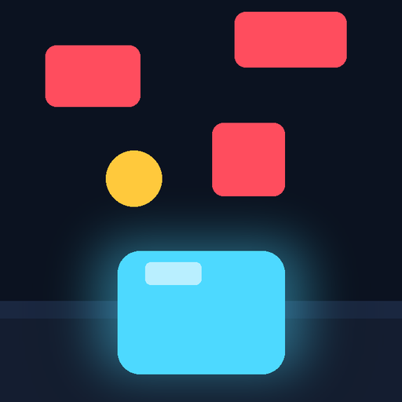
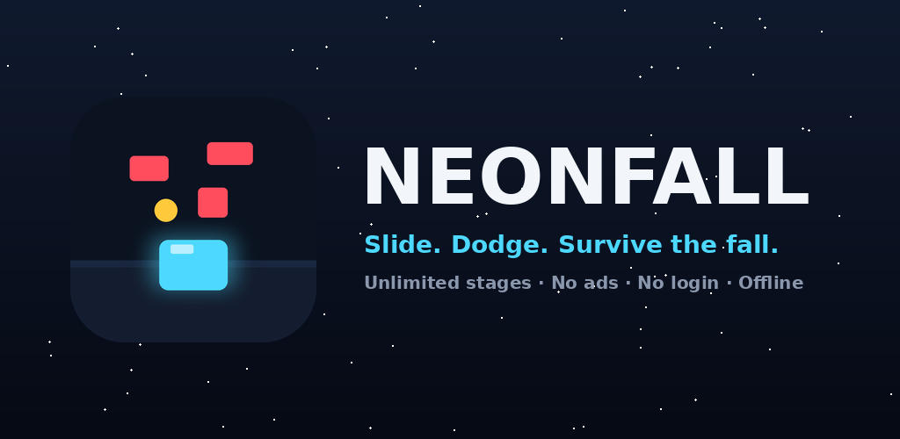

<p align="center">
  
</p>

<h1 align="center">NeonFall</h1>
<p align="center"><b>Slide. Dodge. Survive the fall.</b></p>
<p align="center">A tiny, fast, endless arcade dodger for Android. No login. No ads. No internet. Unlimited stages.</p>

<p align="center">
  
</p>

---

## Get the APK

Every push to `main` builds an APK automatically with GitHub Actions.

1. Go to the **Actions** tab of this repo → latest **Build APK** run → download the `NeonFall-APKs` artifact.
2. Or push a tag like `v1.0.0` and the APK is attached to a **GitHub Release**.

Install `NeonFall-debug.apk` on your phone (allow "install from unknown sources").

## The game

You are a neon slider at the bottom of the screen. Red blocks fall from the top. Gold coins fall too.

| Control | Action |
|---|---|
| Hold **left half** of screen | slide left |
| Hold **right half** of screen | slide right |
| Tap **⏸** (top-right) or **Back** | pause / resume |
| Back on game-over | return to menu |

### Scoring

| Event | Points |
|---|---|
| Block passes you | +1 |
| Near miss (block passes right beside you) | +3 |
| Coin collected | +10 |
| Stage cleared | +100 |

### Stages

A stage is a survival timer (12 s at stage 1, slowly growing to 24 s). Survive it and the next stage begins. Every stage:

- blocks fall faster (`380 + 42 × stage` px/s, scaled to screen height)
- blocks spawn more often (down to one every 0.16 s)
- background stars scroll faster

Difficulty is a pure function of the stage number, so there is no final stage. Your best score and best stage are saved locally on the device.

### Feedback & feel

- Particle bursts for coins, stage clears and crashes
- Screen shake and haptic buzz on impact
- Engine trail behind the player, tilt when sliding
- Animated splash screen (Android 12 style, backported to Android 7)
- Immersive full-screen play, screen stays on

## Project layout

```
NeonFall/
├── .github/workflows/android.yml   CI: builds debug + release APKs
├── app/src/main/
│   ├── java/com/neonfall/game/
│   │   ├── MenuActivity.kt        splash + main menu (best score, how to play)
│   │   ├── GameActivity.kt        full-screen host, pause on back
│   │   ├── GameView.kt            the whole game (loop, physics, rendering, HUD)
│   │   └── Prefs.kt               local high-score storage
│   └── res/
│       ├── drawable/              adaptive icon layers, buttons, backgrounds
│       ├── mipmap-*/              launcher icons (adaptive + legacy PNGs)
│       ├── layout/activity_menu.xml
│       └── values/                colors, strings, themes (splash theme)
├── store/                          icon-512, feature graphic, screenshot for Play listing
├── docs/                           landing page (enable GitHub Pages → /docs)
└── README.md
```

## Build locally

Requirements: Android Studio Hedgehog+ (or JDK 17 + Android SDK 34).

```bash
git clone <your-repo-url>
cd NeonFall
# Android Studio: File → Open → this folder → Run ▶
# or command line:
gradle wrapper && ./gradlew assembleDebug
# → app/build/outputs/apk/debug/app-debug.apk
```

## Tune the difficulty

All knobs are at the top of `GameView.kt`:

```kotlin
const val BASE_STAGE_SECONDS = 12f
const val BASE_SPEED = 380f
const val SPEED_PER_STAGE = 42f
const val MIN_SPAWN = 0.16f
const val STAGE_CLEAR_BONUS = 100
const val COIN_VALUE = 10
const val NEAR_MISS_VALUE = 3
```

## Brand

| Token | Hex | Use |
|---|---|---|
| Night | `#0B1220` | background |
| Surface | `#141D30` | cards |
| Neon cyan | `#4DD9FF` | player, primary button |
| Coral | `#FF4D5E` | hazards |
| Gold | `#FFC93C` | coins, best score |
| Ink | `#F2F5F9` | text |

Typeface: system `sans-serif-black` for titles, default sans for body. No bundled fonts, no image assets in the APK — everything is drawn with vectors and Canvas, so the release APK is under 2 MB.

## Release signing (optional)

CI produces an unsigned release APK. To sign it, create a keystore, add `KEYSTORE_BASE64`, `KEYSTORE_PASSWORD`, `KEY_ALIAS`, `KEY_PASSWORD` as repo secrets, and add a `signingConfigs` block in `app/build.gradle.kts`. The debug APK is installable as-is.

## License

MIT — see [LICENSE](LICENSE).
